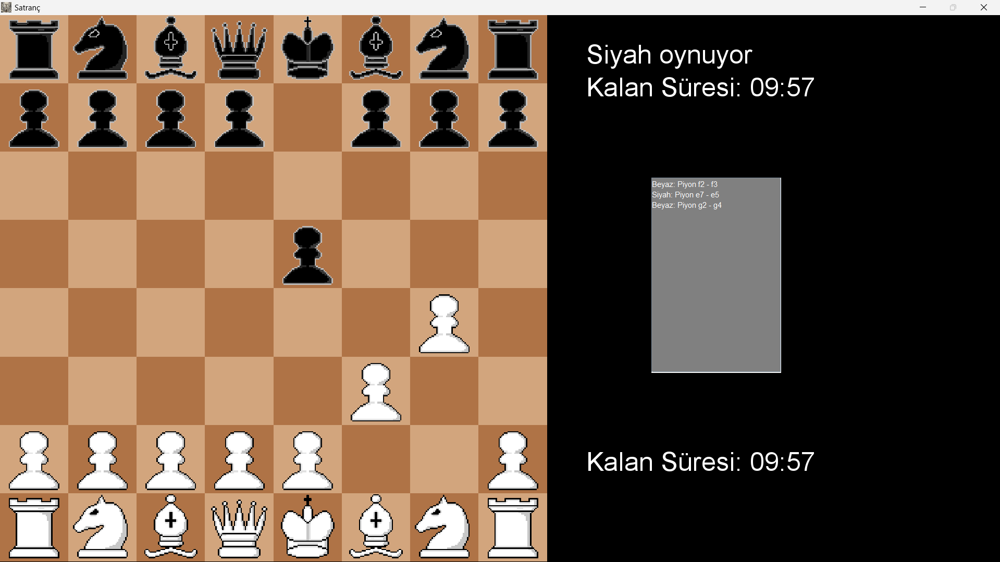

# Satranç Oyunu

Bu, Java'da geliştirilen basit bir satranç oyunudur. Grafiksel bir kullanıcı arayüzü üzerinden satranç oynamanıza olanak tanır. Bu proje, Java programlama becerilerimi geliştirmek amacıyla Ryisnow'un bir öğreticisini takip ederek oluşturulmuştur.

## Özellikleri

- İki oyuncu tek bir cihaz üzerinden oynayabilecek şekilde tasarlandı.
- Standart satranç kurallarını destekler.
- Taşlar kendi kurallarına göre hareket eder.
- Taşların oynadığı hareketleri listeler ve bir .txt dosyasında saklar.

## Referanslar

Bu projeyi geliştirirken aşağıdaki kaynağı kullandım:

- Ryisnow'un YouTube kanalı: [Java Satranç Oyunu Eğitimi](https://www.youtube.com/watch?v=jzCxywhTAUI)